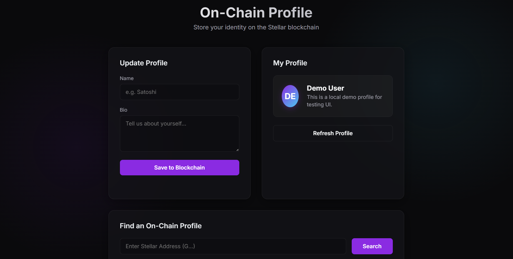
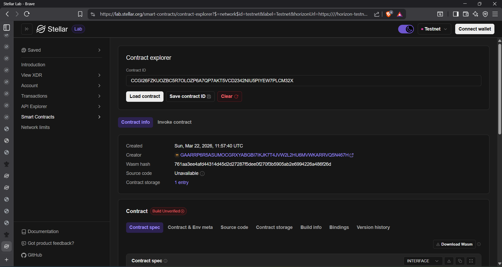

# On-Chain Profile Storage 📇

A fully functional, decentralized Web3 application built on the Stellar Soroban blockchain. This dApp allows users to securely store, retrieve, and search for personal profiles (Name and Bio) on-chain, featuring a sleek, premium dark-themed Next.js frontend and an optimized Rust smart contract.

## Deployment Details

*   **Contract ID / Address:** `CCGI26FZKUOZBC5R7OLOZP6A7QP7AKT5VCD2342NIU5PIYEW7PLCM32X`
*   **Network:** Stellar Testnet

## Dashboard Overview

<!-- This uses the second screenshot you provided -->


## Stellar Lab Verification

<!-- This uses the first screenshot you provided -->



## Features ✨

*   **Non-Custodial Wallet Integration:** Securely connect and sign transactions using the [Freighter Browser Extension](https://www.freighter.app/).
*   **On-Chain Identity:** Store your personal profile securely directly on the Stellar ledger using Soroban's `Persistent` storage maps.
*   **Global Profile Search:** Look up any user's profile instantly on the network using their public Stellar wallet address.
*   **Premium UI:** A beautiful, responsive, and modern dark-themed frontend built with Next.js and React.
*   **Built-in Demo Mode:** An integrated sandbox feature to test out the UI and explore the dashboard without needing to connect a real wallet extension.

## Project Architecture 🏗️

The project is divided into two main components:

1.  **Smart Contract (`/contracts/profile-storage`)**: Written in Rust using the Soroban SDK. It handles the core logic, storing user data securely mapping `Address` to `(Name, Bio)` strings.
2.  **Frontend (`/frontend`)**: A modern Next.js application that integrates with the `@stellar/stellar-sdk` and `@stellar/freighter-api` to interact with the deployed contract on the Soroban Testnet.

---

## Getting Started 🚀

### Prerequisites

*   [Node.js](https://nodejs.org/) (v18+)
*   [Rust](https://www.rust-lang.org/) and `Cargo`
*   [Stellar CLI](https://developers.stellar.org/docs/build/smart-contracts/getting-started/setup)
*   `wasm32-unknown-unknown` target installed (`rustup target add wasm32-unknown-unknown`)
*   [Freighter Wallet Extension](https://www.freighter.app/)

### 1. Smart Contract

The core contract logic is located in the `contracts/profile-storage` directory.

1. Navigate to the contract directory:
   ```bash
   cd contracts/profile-storage
   ```
2. Build the optimized `.wasm` binary:
   ```bash
   cargo build --target wasm32-unknown-unknown --release
   ```
3. Run unit tests to verify the contract logic behaves exactly as expected:
   ```bash
   cargo test
   ```
4. Deploy the contract (ensure you have the Stellar CLI and a funded wallet configured):
   ```bash
   stellar contract deploy \
     --wasm target/wasm32-unknown-unknown/release/profile_storage.wasm \
     --source your_funded_account \
     --network testnet \
     --alias profile_storage
   ```

### 2. Frontend Application

The frontend is built with Next.js.

1. Navigate to the frontend directory from the root:
   ```bash
   cd frontend
   ```
2. Install dependencies:
   ```bash
   npm install
   ```
3. Start the development server:
   ```bash
   npm run dev
   ```
4. Open your browser to `http://localhost:3000`.

### Connecting your Wallet

1. Install the Freighter browser extension.
2. Switch the Freighter network to **Testnet** (via Settings -> Network).
3. Fund your Freighter wallet using the [Friendbot](https://laboratory.stellar.org/#account-creator?network=test).
4. Enter your deployed **Contract ID** on the main dashboard screen.
5. Click **Connect with Freighter Wallet** to start testing the on-chain profile features!
